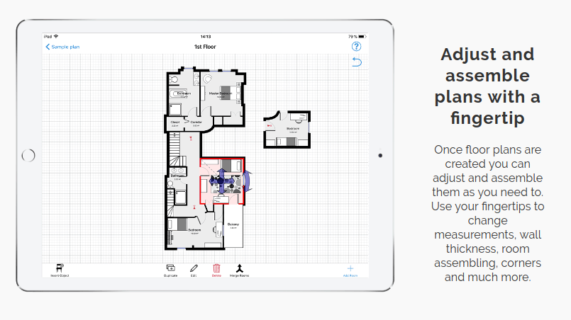
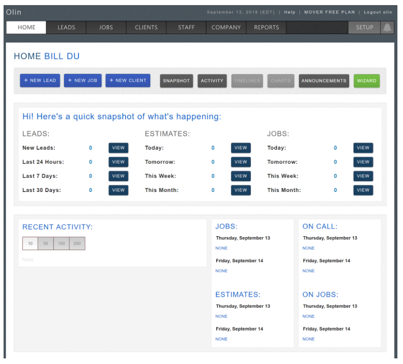

# Team Ice Cream Scoop: Helping You Move Since 2018

## Inspirational Designs

### Sortly (by Ilya)
Sortly is an online service specializing in inventory in the context of organization, moving and general tracking purposes for businesses and individuals. In the moving category, their slogan is Stress Less During Your Move - keep calm and move comfortably knowing where everything is packed.

#### Visual Tracking
Sortly’s app allows customers to create lists and visually document their items to make them easier to track. Users can create custom notes for each item or box and tag it by location or category. They can even create scannable QR codes to label each box with specific contents. Part of the apps functionality allows users to distinguish which items they care deeply for and which they are looking to get rid of during the move.

#### Design
Their website is modern and fluid, a pleasure to look through. They use a friendly, empathetic tone in addressing their customers. Their awareness of the common stress and difficulties of moving is clear. They want to make people’s lives easier and turn difficult tasks into enjoyable experiences.

### MagicPlan (by Mary)
MagicPlan uses pictures to create detailed floor plans, which it can then use to create quotes for construction and generate annotated reports (for those using the service for business). It allows new homeowners/renters to plan out where everything will go in their new home, so they don’t end up moving furniture or other items they’ll get rid of anyway. This approach to simplifying the moving process offers a few insights. 

First, not everyone will move everything from one place to another, so helping them realize what they won’t need in their new home ahead of time will make moving inherently easier (because there will be less to move). If we’re trying to help them differentiate between boxes, we can do so by decreasing the number of boxes of stuff they have. 

Second, manually entering information is tedious, especially if you have a large number of belongings. I was able to use the MagicPlan app to map the bathroom and living room of my suite in about three minutes once I figured out how the app worked, which was much faster than measuring each wall, entering that into some piece of software, then explaining how the walls relate to each other, and so on. We should come up with more creative ways to collect the information we need.

Third, the MagicPlan app has a lot of different functionalities (like creating quotes), which could be useful, but ends up making the app feel cluttered and unintuitive. It was easy to map the rooms, but beyond that, the app was confusing -- for example, why does the app have a whole separate cost section for tax information instead of building tax information into its quoted prices? Plus, it never asked where my supposed house is, but I imagine it needs that information for taxes and I don’t know how to add my address. If I only want to create a floor plan, what information do I actually need to add? We should create a software solution to moving headaches that does its single job and nothing more to make the experience more straightforward. 

### Moverbase (by Bill)
Moverbase is a web based software that helps manage the operation of moving companies. In order to gain access to a variety of features, moving companies need to pay 0-299 USD per month to subscribe to the software. The basic functionalities include work scheduling, job management, staff management, client management, supplies calculator and quick email services between the mover and the client. This software builds up an interface for moving companies to better manage their job. However, I can hardly see it being popular, since it is neither for big moving companies that have their own database and online software, nor for small companies that do not require such a complex cloud system to operate. There is a lot of detailed information displayed on the dashboard, but the user interface is a bit messy, and the software website looks a lot better than the dashboard. This software aims to do all the things to manage a moving company, but it doesn’t do everything very well. Furthermore, there’s no custom features that fit companies own needs. There is no review for the web version of the product and very few reviews (less than 5) on Google Play. 

### Other Ideas
- Unpakt helps you book, manage, and pay for your move within the mobile/web app; lets you create an inventory list to see how much it’ll cost to move certain items and shows you multiple quotes
- Flip is an app that helps tenants find credible subletters and deal with the landlord; “Flip is an advocate, assistant, and housing expert all rolled into one” -- Business Insider
- Moved is a free app that pairs you with a personal assistant to help you organize/execute your move via text
- ThredUP helps you get rid of old clothes and make some money; sends a huge plastic bag with prepaid return shipping, which you fill up and send back (what they don’t buy, they donate)
- Moving Checklist Pro comes with a list of tasks you need for moving (like finding nearby doctors, banks, cell phone providers, DMV, cancelling services, changing address for newspapers, etc)

## Consent Form

#### Who are we?
We are a group of students from Olin College of Engineering taking a course in User Experience Design. Our team is researching moving pains with the goal of using our findings to develop a solution with a positive user experience.

#### What do we want from you?
We’d like to speak to you about your moving experiences and possibly receive feedback on prototypes. Your feedback is crucial to us creating a positive user experience. Engineering doesn’t happen in a bubble; your input from people outside of our project will help us look at our ideas in new ways and challenge our assumptions. We respect your time and anticipate this interaction will last less than a half hour.

We will collect information by...
- Taking notes
- Taking photos
- Recording audio
- Recording video
- Keeping artifacts created during co-design

#### What are the risks or benefits?
We don’t expect any risk to you. We won’t collect personal information or personally identify you when we talk about our project to others. Additionally, you are free at any time to leave, change topics, or request we not use the anonymous information we do collect if for any reason you feel uncomfortable. These conversations are purely voluntary, and no monetary compensation will be offered. However, there will be the added benefit to you of knowing that your opinions directly help us in our learning!

#### How can you contact us?
If you’d like to speak to us further, you can reach us at:

Mary Keenan: mary.keenan@students.olin.edu

Ilya Besancon: ilya.besancon@students.olin.edu

Bill Du: bill.du@students.olin.edu

**Head Faculty:**

Marco Morales: 	marco.morales@olin.edu

Phone number: 	(619) 243 - 6059

